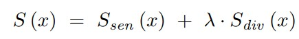

# LSA (Learning with Selective Attention over Seen Classes and Memorized Instances)
## Requirements


 


----
Create a virtual enviroment
```sh
conda create -n online_free_cl python=3.9 or
virtualenv online_free_cl
```
Activating a virtual environment
```sh
source activate online_free_cl or
source online_free_cl/bin/activate
```
Installing packages
```sh
pip install -r requirements.txt
```

## Datasets 
### Online Task-Free Continual Learning
- Split MNIST
- Split CIFAR10
- Split CIFAR100
- Split Mini-ImageNet

### Data preparation
- MNIST & CIFAR10 & CIFAR100 will be downloaded during the first run
- Mini-ImageNet: Download from https://www.kaggle.com/whitemoon/miniimagenet/download , and place it in datasets/mini_imagenet/

## Compared approaches

* EWC++: Efficient and online version of Elastic Weight Consolidation(EWC) (**ECCV, 2018**) [[Paper]](http://arxiv-export-lb.library.cornell.edu/abs/1801.10112)
* iCaRL: Incremental Classifier and Representation Learning (**CVPR, 2017**) [[Paper]](https://arxiv.org/abs/1611.07725)
* LwF: Learning without forgetting (**ECCV, 2016**) [[Paper]](https://link.springer.com/chapter/10.1007/978-3-319-46493-0_37)
* AGEM: Averaged Gradient Episodic Memory (**ICLR, 2019**) [[Paper]](https://openreview.net/forum?id=Hkf2_sC5FX)
* ER: Experience Replay (**ICML Workshop, 2019**) [[Paper]](https://arxiv.org/abs/1902.10486)
* MIR: Maximally Interfered Retrieval (**NeurIPS, 2019**) [[Paper]](https://proceedings.neurips.cc/paper/2019/hash/15825aee15eb335cc13f9b559f166ee8-Abstract.html)
* GSS: Gradient-Based Sample Selection (**NeurIPS, 2019**) [[Paper]](https://arxiv.org/pdf/1903.08671.pdf)
* GDumb: Greedy Sampler and Dumb Learner (**ECCV, 2020**) [[Paper]](https://www.robots.ox.ac.uk/~tvg/publications/2020/gdumb.pdf)
* Online-MAS: Task-Free Continual Learning (**CVPR, 2019**)[[Paper]](https://openaccess.thecvf.com/content_CVPR_2019/papers/Aljundi_Task-Free_Continual_Learning_CVPR_2019_paper.pdf)

## Run commands
Detailed descriptions of options can be found in [general_main.py](general_main.py)

### Sample commands to run algorithms on Split-CIFAR10
```shell
#ER
python general_main.py --data cifar10 --cl_type nc --agent ER --retrieve random --update random --mem_size 500 --test_batch 10 --fix_order True

#MIR
python general_main.py --data cifar10 --cl_type nc --agent ER --retrieve MIR --update random --mem_size 500 --test_batch 10 --fix_order True

#GSS
python general_main.py --data cifar10 --cl_type nc --agent ER --retrieve random --update GSS --eps_mem_batch 10 --gss_mem_strength 20 --mem_size 500 --test_batch 10 --fix_order True

#LwF
python general_main.py --data cifar10 --cl_type nc --agent LWF --test_batch 10 --fix_order True

#iCaRL
python general_main.py --data cifar10 --cl_type nc --agent ICARL --retrieve random --update random --mem_size 500 --test_batch 10 --fix_order True

#EWC++
python general_main.py --data cifar10 --cl_type nc --agent EWC --fisher_update_after 50 --alpha 0.9 --lambda 100 --test_batch 10 --fix_order True

#GDumb
python general_main.py --data cifar10 --cl_type nc --agent GDUMB --mem_size 500 --mem_epoch 1 --minlr 0.0005 --clip 10 --test_batch 10 --fix_order True

#AGEM
python general_main.py --data cifar10 --cl_type nc --agent AGEM --retrieve random --update random --mem_size 500 --test_batch 10 --fix_order True

#Online-MAS:
python general_main.py --data cifar10 --cl_type nc --agent OMAS --retrieve random --update random --mem_size 500 --test_batch 10 --fix_order True
```

### Our LSA
```shell
# LSA_C
python general_main.py --data cifar10 --cl_type nc --agent LSA_C --retrieve random --update random --mem_size 500 --test_batch 10 --fix_order True

# LSA_I
python general_main.py --data cifar10 --cl_type nc --agent ER --retrieve LSA_I --update random --mem_size 500 --test_batch 10 --fix_order True --beta 0.1

# LSA
python general_main.py --data cifar10 --cl_type nc --agent LSA_C --retrieve LSA_I --update random --mem_size 500 --test_batch 10 --fix_order True --beta 0.1
```

### Fix order
```shell
# Alphabetically arranged from class 0-9
python general_main.py --data cifar10 --cl_type nc --agent LSA_C --retrieve LSA_I --update random --mem_size 500 --test_batch 10 --fix_order True --beta 0.1

# Random arranged from class 0-9
python general_main.py --data cifar10 --cl_type nc --agent LSA_C --retrieve LSA_I --update random --mem_size 500 --test_batch 10 --fix_order False --beta 0.1
```

### Trade-off weight


```shell
# MNIST 
python general_main.py --data cifar10 --cl_type nc --agent LSA_C --retrieve LSA_I --update random --mem_size 500 --test_batch 10 --fix_order True --beta 0.15
```

## Repo Structure & Description
    ├──agents                       #Files for different algorithms
        ├──base.py                      #Abstract class for algorithms
        ├──agem.py                      #File for A-GEM
        ├──ewc_pp.py                    #File for EWC++
        ├──exp_replay.py                #File for ER, MIR and GSS
        ├──gdumb.py                     #File for GDumb
        ├──iCaRL.py                     #File for iCaRL
        ├──lsa_c.py                     #File for LSA_C
        ├──lwf.py                       #File for LwF
        ├──omas.py                      #File for Online-MAS

    ├──continuum                     #Files for create the data stream objects
        ├──dataset_scripts              #Files for processing each specific dataset
            ├──dataset_base.py              #Abstract class for dataset
            ├──cifar10.py                   #File for CIFAR10
            ├──cifar100,py                  #File for CIFAR100
            ├──core50.py                    #File for CORe50
            ├──mnist.py                     #File for MNIST
            ├──mini_imagenet.py             #File for Mini_ImageNet
            ├──openloris.py                 #File for OpenLORIS
        ├──continuum.py             
        ├──data_utils.py
        ├──non_stationary.py

    ├──models                       #Files for backbone models
        ├──pretrained.py                #Files for pre-trained models
        ├──resnet.py                    #Files for ResNet

    ├──utils                        #Files for utilities
        ├──buffer                       #Files related to buffer
            ├──buffer.py                    #Abstract class for buffer
            ├──buffer_utils.py              #General utilities for all the buffer files
            ├──gss_greedy_update.py         #File for GSS update
            ├──lsa_i.py                     #File for LSA_I retrieval
            ├──mir_retrieve.py              #File for MIR retrieval
            ├──random_retrieve.py           #File for random retrieval
            ├──reservoir_update.py          #File for random update

        ├──global_vars.py               #Global variables for CN-DPM
        ├──io.py                        #Code related to load and store csv or yarml
        ├──kd_manager.py                #File for knowledge distillation
        ├──name_match.py                #Match name strings to objects 
        ├──setup_elements.py            #Set up and initialize basic elements
        ├──utils.py                     #File for general utilities

    ├──config                       #Config files for hyper-parameters tuning
        ├──agent                        #Config files related to agents
        ├──data                         #Config files related to dataset

        ├──general_*.yml                #General yml (fixed variables, not tuned)
        ├──global.yml                   #paths to store results 

## Acknowledgments
[Online Continual Learning in Image Classification: An Empirical Survey] [[Paper]](https://authors.elsevier.com/a/1e1YV3INukGu7J) [[Code]](https://github.com/RaptorMai/online-continual-learning/)
